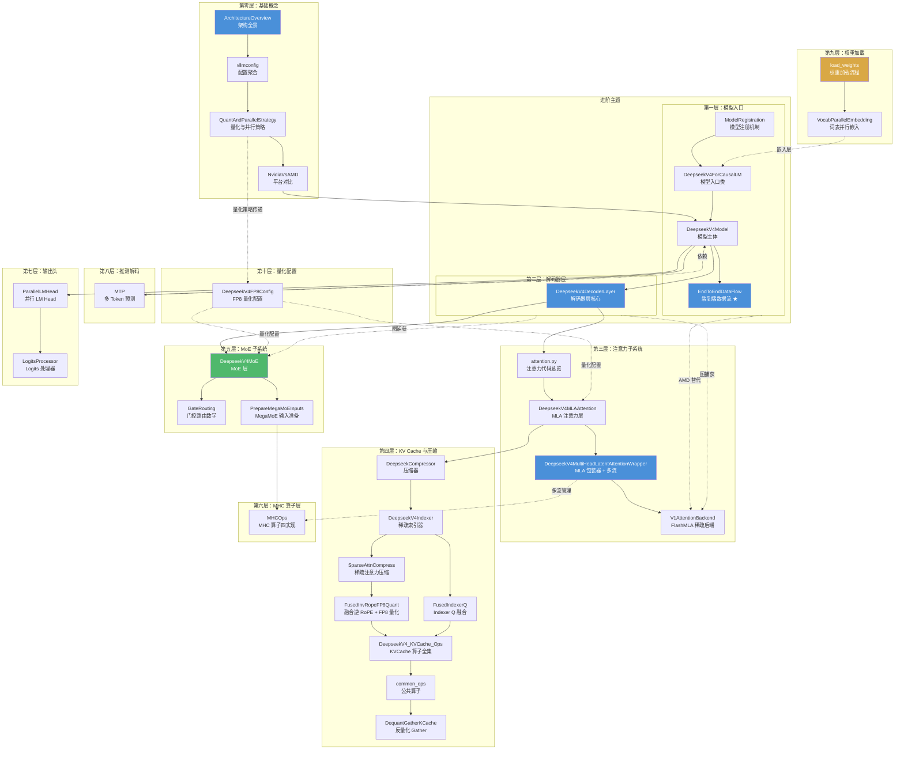

# DeepSeek V4 笔记导读

本文档说明所有笔记文件之间的关系及最佳阅读顺序。



## 推荐阅读路径

### 🟦 主线路径（从入门到精通）

```
第零层：基础概念
  └── ArchitectureOverview → vllmconfig → QuantAndParallelStrategy → NvidiaVsAMD

第一层：模型入口
  └── ModelRegistration → DeepseekV4ForCausalLM → DeepseekV4Model → EndToEndDataFlow ★

第二层：解码器
  └── DeepseekV4DecoderLayer

第三层：注意力
  └── attention.py → DeepseekV4MLAAttention → DeepseekV4MultiHeadLatentAttentionWrapper
                                                      └── V1AttentionBackend

第四层：KV Cache
  └── DeepseekCompressor → DeepseekV4Indexer → SparseAttnCompress
       └── FusedInvRopeFP8Quant / FusedIndexerQ → DeepseekV4_KVCache_Ops → common_ops

第五层：MoE
  └── DeepseekV4MoE → GateRouting → PrepareMegaMoEInputs → MHCOps

第六层：输出 → 第七层：推测解码 → 第八层：权重加载 → 第九层：量化配置
  └── ParallelLMHead → LogitsProcessor → MTP → load_weights → DeepseekV4FP8Config

进阶：ROCmBackend → CUDAGraphIntegration
```

### 具体阅读顺序建议

#### 🟦 第一遍：整体认知（适合快速通读）

| 步骤 | 笔记 | 预期收获 |
|------|------|---------|
| 1 | [[ArchitectureOverview]] | 了解 V4 整体架构、有哪些创新点 |
| 2 | [[vllmconfig]] | 熟悉关键配置项及其影响 |
| 3 | [[QuantAndParallelStrategy]] | 理解量化在哪里发生、并行怎么切分 |
| 4 | [[NvidiaVsAMD]] | 了解两个平台的差异 |
| 5 | [[DeepseekV4ForCausalLM]] → [[DeepseekV4Model]] | 模型入口和主体结构 |
| 6 | [[EndToEndDataFlow]] ★ | **单条数据完整路径速览** |
| 7 | [[DeepseekV4DecoderLayer]] | 解码器层的融合设计 |

#### 🟩 第二遍：深入关键模块（选择性阅读）

| 步骤 | 笔记 | 预期收获 |
|------|------|---------|
| 8 | [[attention.py]] → [[DeepseekV4MLAAttention]] | MLA 注意力机制 |
| 9 | [[DeepseekV4MultiHeadLatentAttentionWrapper]] | 多流并行 + HC 混合 |
| 10 | [[DeepseekV4MoE]] → [[GateRouting]] | MoE 路由逻辑 |
| 11 | [[DeepseekCompressor]] → [[DeepseekV4Indexer]] | KV 压缩和稀疏索引 |
| 12 | [[MHCOps]] | 理解 mhc_pre/mhc_post 底层实现 |
| 13 | [[MTP]] | 推测解码的工作方式 |

#### 🟨 第三遍：工程细节（按需查阅）

| 步骤 | 笔记 | 预期收获 |
|------|------|---------|
| 14 | [[load_weights]] + [[VocabParallelEmbedding]] | 权重加载流程 |
| 15 | [[FusedInvRopeFP8Quant]] + [[FusedIndexerQ]] | 融合算子的底层细节 |
| 16 | [[DeepseekV4_KVCache_Ops]] + [[common_ops]] | KV Cache 的全部算子 |
| 17 | [[ROCmBackend]] + [[CUDAGraphIntegration]] | AMD 和 CUDA Graph 适配 |
| 18 | [[V1AttentionBackend]] | V1 框架集成 |

---

## 笔记分类速查

### 全景类（先读）
| 笔记 | 核心内容 |
|------|---------|
| [[ArchitectureOverview]] | V4 架构全景，HC 机制解释 |
| [[vllmconfig]] | 所有配置项及其效果 |
| [[QuantAndParallelStrategy]] | 量化点和并行策略 |
| [[NvidiaVsAMD]] | 双平台实现对比 |
| [[EndToEndDataFlow]] | 一条 token 的完整数据流（含 shape 变化） |

### 模型结构类
| 笔记 | 核心内容 |
|------|---------|
| [[DeepseekV4ForCausalLM]] | 入口：forward、load_weights、MTP 接口 |
| [[DeepseekV4Model]] | 主体：embed → layers → norm → lm_head |
| [[DeepseekV4DecoderLayer]] | 单层：融合 attn 和 ffn 的 HC 前后处理 |
| [[ParallelLMHead]] | 词表投影头 |
| [[LogitsProcessor]] | Logits 后处理 |

### 注意力类
| 笔记 | 核心内容 |
|------|---------|
| [[attention.py]] | Attention 模块代码总览 |
| [[DeepseekV4MLAAttention]] | MLA 层：QKV 低秩投影 + 稀疏注意力 |
| [[DeepseekV4MultiHeadLatentAttentionWrapper]] | MLA 包装器：多流并行 + fused_wqa_wkv |
| [[V1AttentionBackend]] | V1 框架的 FlashMLA 后端 |

### KV Cache 类
| 笔记 | 核心内容 |
|------|---------|
| [[DeepseekCompressor]] | KV 压缩器：state cache + softmax 加权 |
| [[DeepseekV4Indexer]] | 稀疏索引器：topk 选择 + 稀疏注意力元数据 |
| [[SparseAttnCompress]] | 稀疏注意力压缩机制 |
| [[FusedInvRopeFP8Quant]] | 注意力输出融合逆 RoPE + FP8 量化 |
| [[FusedIndexerQ]] | Indexer Q 的 RoPE + 量化融合 |
| [[DeepseekV4_KVCache_Ops]] | fused_compress_quant_cache + cache_utils |
| [[common_ops]] | 跨平台公共算子 |
| [[DequantGatherKCache]] | K Cache 反量化 gather |

### MoE 类
| 笔记 | 核心内容 |
|------|---------|
| [[DeepseekV4MoE]] | MoE 层：gate + experts + shared experts |
| [[GateRouting]] | 门控路由数学：sqrtsoftplus / Hash MoE / Noaux TC |
| [[PrepareMegaMoEInputs]] | MegaMoE 的 Triton 预处理 |

### 算子层
| 笔记 | 核心内容 |
|------|---------|
| [[MHCOps]] | MHC 四实现（TileLang/Triton/Torch/Aiter） |

### 推测解码类
| 笔记 | 核心内容 |
|------|---------|
| [[MTP]] | Multi-Token Prediction 完整实现 |

### 配置与加载类
| 笔记 | 核心内容 |
|------|---------|
| [[DeepseekV4FP8Config]] | FP8/FP4 量化配置分发 |
| [[load_weights]] | 权重加载流程 |
| [[VocabParallelEmbedding]] | 词表并行嵌入 |
| [[ModelRegistration]] | 模型注册机制 |

### 进阶类
| 笔记 | 核心内容 |
|------|---------|
| [[ROCmBackend]] | AMD ROCm 注意力后端 |
| [[CUDAGraphIntegration]] | CUDA Graph 兼容策略 |

---

## 依赖关系速查

要理解笔记 A，建议先读笔记 B：

| 笔记 | 前置依赖 |
|------|---------|
| [[DeepseekV4ForCausalLM]] | [[ArchitectureOverview]], [[vllmconfig]] |
| [[DeepseekV4Model]] | [[DeepseekV4ForCausalLM]] |
| [[DeepseekV4DecoderLayer]] | [[DeepseekV4Model]] |
| [[attention.py]] | [[DeepseekV4DecoderLayer]] |
| [[DeepseekV4MLAAttention]] | [[attention.py]] |
| [[DeepseekV4MultiHeadLatentAttentionWrapper]] | [[DeepseekV4MLAAttention]], [[QuantAndParallelStrategy]] |
| [[DeepseekV4MoE]] | [[DeepseekV4DecoderLayer]], [[DeepseekV4FP8Config]] |
| [[GateRouting]] | [[DeepseekV4MoE]] |
| [[MHCOps]] | [[DeepseekV4DecoderLayer]], [[QuantAndParallelStrategy]] |
| [[MTP]] | [[DeepseekV4Model]], [[DeepseekV4DecoderLayer]], [[load_weights]] |
| [[EndToEndDataFlow]] | [[DeepseekV4Model]], [[DeepseekV4DecoderLayer]], [[DeepseekV4MLAAttention]], [[DeepseekV4MoE]] |
| [[ROCmBackend]] | [[V1AttentionBackend]], [[NvidiaVsAMD]], [[DeepseekV4_KVCache_Ops]] |
| [[CUDAGraphIntegration]] | [[DeepseekV4Model]], [[V1AttentionBackend]] |
